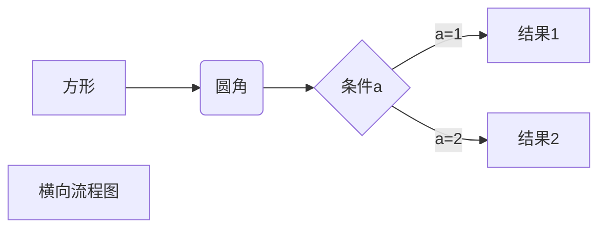
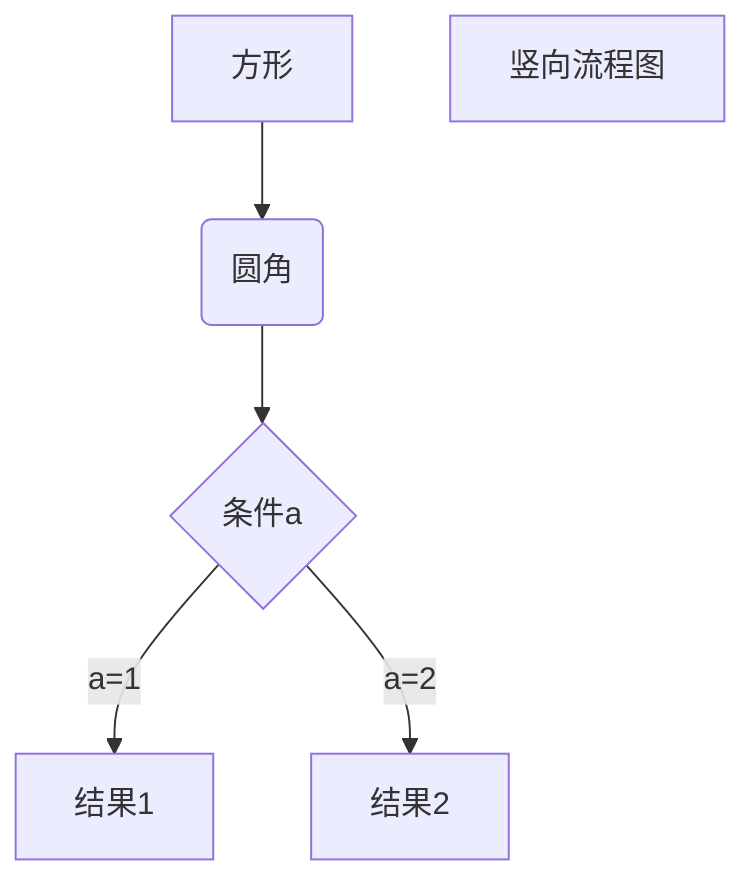
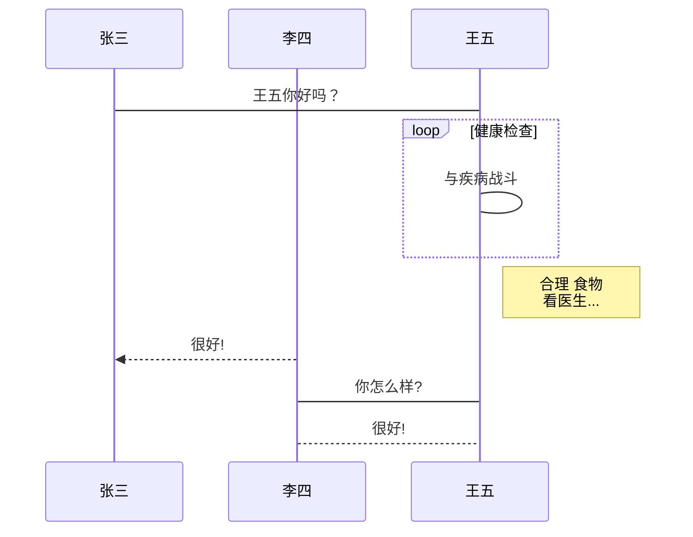
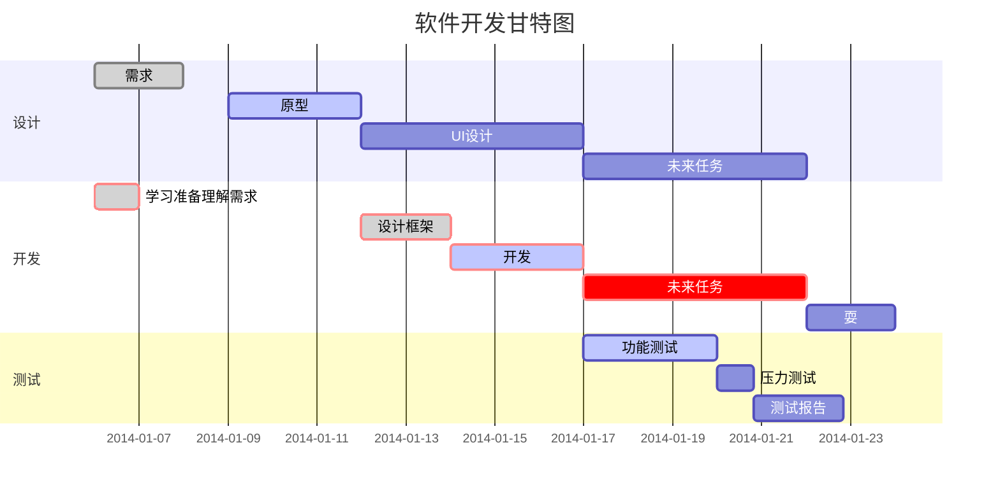

# markdown manual

## 1. 标题
使用<kbd>#</kbd> + <kbd>空格</kbd> 来写标题 <kbd>#</kbd>个数代表标题级别 
eg:
###  三级标题
#### 四级标题
##### 五级标题

## 2. 字体

*字体倾斜*
**字体加粗**
***字体斜体加粗***
~~删除线~~
<u>下划线</u>
`文本高亮`
按键效果：新建图形文件 <kbd>Ctrl</kbd> + <kbd>Del</kbd>
==字体高亮==
我是 ^上标^ : X^2^
我是 ~下标~ : H~2~O
脚注
脚注是对文本的补充说明。
Markdown 脚注的格式如下:
[^要注明的文本]

以下实例演示了脚注的用法：

创建脚注格式类似这样 [^RUNOOB]。

[^RUNOOB]: 菜鸟教程 -- 学的不仅是技术，更是梦想！！！

分割线：
***
---


## 3.列表
无序列表使用星号(*)、加号(+)或是减号(-)作为列表标记，这些标记后面要添加一个空格，然后再填写内容：

* 第一项
* 第二项
* 第三项

+ 第一项
+ 第二项
+ 第三项


- 第一项
- 第二项
- 第三项

有序列表使用数字并加上 . 号来表示，如：

1. 第一项
2. 第二项
3. 第三项

列表嵌套
列表嵌套只需在子列表中的选项前面添加四个空格即可：

1. 第一项：
    - 第一项嵌套的第一个元素
    - 第一项嵌套的第二个元素
2. 第二项：
    - 第二项嵌套的第一个元素
    - 第二项嵌套的第二个元素

## 表格
Markdown 制作表格使用 | 来分隔不同的单元格，使用 - 来分隔表头和其他行。
语法格式如下：

|  表头   | 表头  |
|  ----  | ----  |
| 单元格  | 单元格 |
| 单元格  | 单元格 |
对齐方式

我们可以设置表格的对齐方式：

-: 设置内容和标题栏居右对齐。
:- 设置内容和标题栏居左对齐。
:-: 设置内容和标题栏居中对齐。

实例如下：
| 左对齐 | 右对齐 | 居中对齐 |
| :-----| ----: | :----: |
| 单元格 | 单元格 | 单元格 |
| 单元格 | 单元格 | 单元格 |

## 4.区块
Markdown 区块引用是在段落开头使用 > 符号 ，然后后面紧跟一个空格符号：
另外区块是可以嵌套的，一个 > 符号是最外层，两个 > 符号是第一层嵌套，以此类推：

> 最外层
> > 第一层嵌套
> >
> > > 第二层嵌套

==列表和区块可以相互嵌套==

## 代码块
```python
for i in range(1,10)
	print(i)
```

## 5.链接、图片
### 链接使用方法如下：
[链接名称](链接地址)或者<链接地址>
这是一个链接 [菜鸟教程](https://www.runoob.com)
直接使用链接<https://www.runoob.com>
### 图片
Markdown 图片语法格式如下：


## 高级技巧
### 转义字符
\* \* 特殊字符转义\* \*

### 公式
$$
\mathbf{V}_1 \times \mathbf{V}_2 =  \begin{vmatrix} 
\mathbf{i} & \mathbf{j} & \mathbf{k} \\
\frac{\partial X}{\partial u} &  \frac{\partial Y}{\partial u} & 0 \\
\frac{\partial X}{\partial v} &  \frac{\partial Y}{\partial v} & 0 \\
\end{vmatrix}
${$tep1}{\style{visibility:hidden}{(x+1)(x+1)}}
$$

### 流程图、标准流程图、UML时序图、甘特图
以下几个实例效果图如下：

1、横向流程图源码格式：


2、竖向流程图源码格式：


3、标准流程图源码格式：

```flow
st=>start: 开始框
op=>operation: 处理框
cond=>condition: 判断框(是或否?)
sub1=>subroutine: 子流程
io=>inputoutput: 输入输出框
e=>end: 结束框
st->op->cond
cond(yes)->io->e
cond(no)->sub1(right)->op
```
4、标准流程图源码格式（横向）：

```flow
st=>start: 开始框
op=>operation: 处理框
cond=>condition: 判断框(是或否?)
sub1=>subroutine: 子流程
io=>inputoutput: 输入输出框
e=>end: 结束框
st(right)->op(right)->cond
cond(yes)->io(bottom)->e
cond(no)->sub1(right)->op
```
5、UML时序图源码样例：

```sequence
对象A->对象B: 对象B你好吗?（请求）
Note right of 对象B: 对象B的描述
Note left of 对象A: 对象A的描述(提示)
对象B-->对象A: 我很好(响应)
对象A->对象B: 你真的好吗？
```
6、UML时序图源码复杂样例：

```sequence
Title: 标题：复杂使用
对象A->对象B: 对象B你好吗?（请求）
Note right of 对象B: 对象B的描述
Note left of 对象A: 对象A的描述(提示)
对象B-->对象A: 我很好(响应)
对象B->小三: 你好吗
小三-->>对象A: 对象B找我了
对象A->对象B: 你真的好吗？
Note over 小三,对象B: 我们是朋友
participant C
Note right of C: 没人陪我玩
```
7、UML标准时序图样例：


8、甘特图样例：




